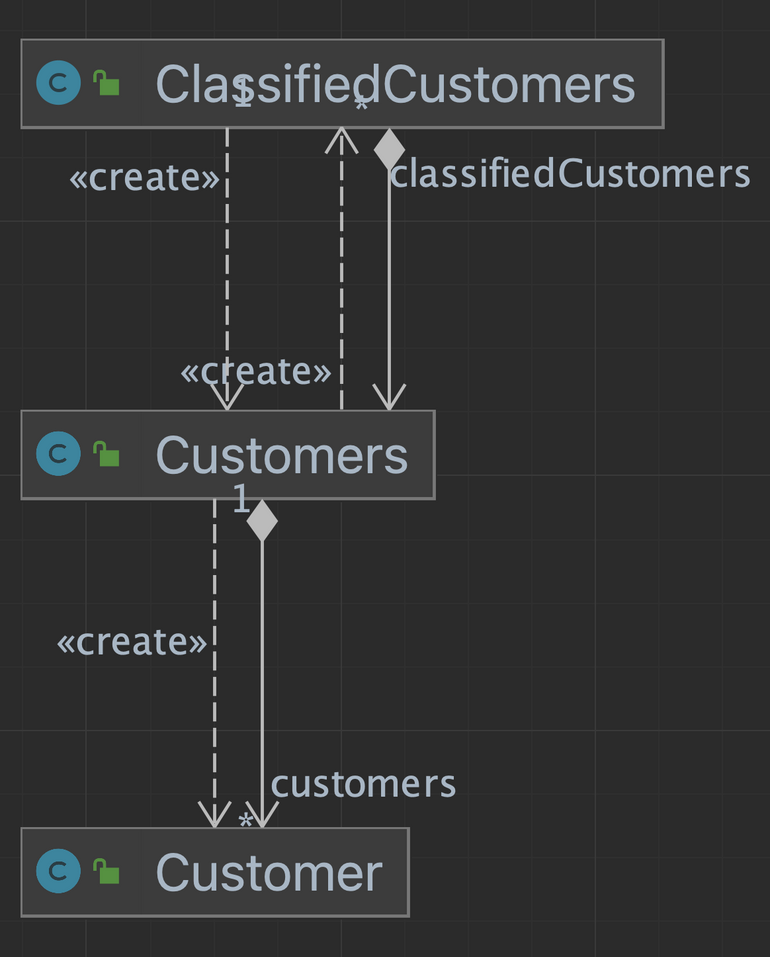
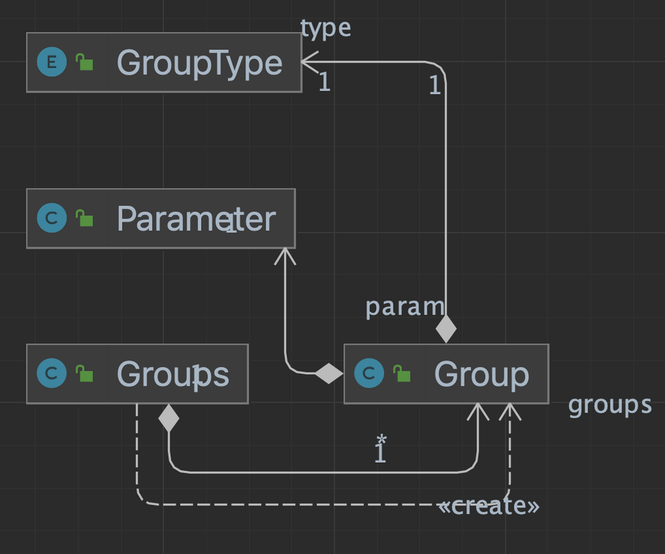
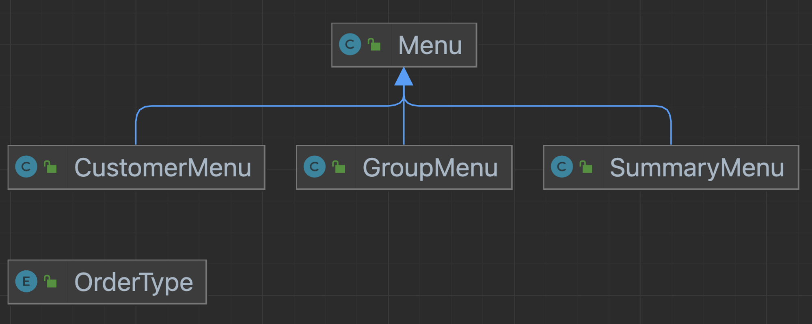

# Java-ToyProject
패스트캠퍼스 자바 실시간 강의 토이프로젝트Ⅰ

## Smart Store - 스마트스토어 운영진을 위한 고객 분류 프로그램 개발

📌 **프로젝트 주제**

- `프로젝트 유형`
    - 개별 프로젝트 👤
- `유의사항`
    - 해당 프로젝트는 클래스 및 메소드 설계를 직접 해보는 것이 목적이므로,
      `List, Set, Map 같은 컬렉션 프레임워크의 사용은 금합니다.` (`Arrays`는 제외)
    - [List](https://docs.oracle.com/javase/8/docs/api/java/util/List.html), [Set](https://docs.oracle.com/javase/8/docs/api/java/util/Set.html), [Map](https://docs.oracle.com/javase/8/docs/api/java/util/Map.html)의 내부를 분석해보고 이와 비슷하게 직접 함수를 작성해보세요.
- `고객 분류결과`
    - General
    - VIP
    - VVIP
- `고객 분류기준`
    - 분류기준은 *최소 이용시간*과 *최소* *결제금액*으로 정의하고 각 그룹이 되기 위한 *최소 이용시간*과 *최소* *결제금액*은 해당 프로그램을 사용하는 운영진에게 입력받는 형태입니다.
    - *최소 이용시간*과 *최소 결제금액*은 정해져있는 값이 아니고 나중에 수정할 경우 고객이 다시 분류되게끔 개발해야합니다.

 

| 고객 분류결과 | 최소 이용시간 | 최소 결제금액 |
| --- | --- | --- |
| General | t_1 시간 (입력 변수) | p_1 만원 (입력 변수) |
| VIP | t_2 시간 (입력 변수) | p_2 만원 (입력 변수) |
| VVIP | t_3 시간 (입력 변수) | p_3 만원 (입력 변수) |

 

🗓️ **프로젝트 일정**

| 일정 | 기간 | 제출방법 | 비고 |
| --- | --- | --- | --- |
| 프로젝트 소개 | ~ 23.04.27 |  |  |
| 프로젝트 기간 | ~ 23.05.15 23:59 |  |  |

 

📌 **프로젝트 정의서**

- 스마트스토어를 운영 중인 Sally는 본인이 운영 중인 스마트스토어에서 한번이라도 구매 이력이 있는 고객들의 정보를 가지고 있다고 가정하자.
- Sally가 가진 고객정보는 다음과 같다.
    - 고객 이름
    - 고객 아이디
    - 고객 스마트스토어를 이용시간 → `분류기준`
        - `10, 20, 30시간 …`
    - 고객 스마트스토어에서 구매한 총 결제금액 → `분류기준`
        - `100,000원, 200,000원 …`
- Sally는 스마트스토어 *최소 이용시간*과 *최소* *결제금액*에 따라 고객을 세 개의 그룹으로 분류하고 싶다고 가정하자.
    - General
    - VIP
    - VVIP

 

📌 **프로젝트 요구사항**

- 객체지향 성격이 잘 들어날 수 있도록 클래스를 설계하자.
- 프로젝트 기능구현을 위한 필요한 메소드를 정의하고 구현해보자.
- 기능
    - 분류기준
        - 고객의 분류기준을 입력할 수 있다.
        - 고객의 분류기준을 설정할 수 있다.
        - 고객의 분류기준을 수정할 수 있다.
    - 고객정보
        - 고객의 정보를 입력할 수 있다.
        - 고객의 정보를 추가할 수 있다.
        - 고객의 정보를 삭제할 수 있다.
    - 고객 분류기능
        - 분류기준에 의해 고객을 분류할 수 있다.
        - 분류기준에 의해 분류된 고객의 정보를 출력할 수 있다.
        - 분류기준에 의해 분류된 고객의 정보를 이름순으로 정렬할 수 있다.
        - 분류기준에 의해 분류된 고객의 정보를 총 이용시간 순으로 정렬할 수 있다.
        - 분류기준에 의해 분류된 고객의 정보를 총 결제금액 순으로 정렬할 수 있다.
    - 예외처리
        - 고객 분류 기준이 추가될 경우 수정된 분류기준에 의해 고객을 다시 고려할 수 있다.
        - 고객 정보가 추가되거나 삭제될 경우의 시나리오도 생기는 예외도 고려할 수 있다.
            - 추가
                - 배열의 크기가 부족할 수 있음
                - 배열 크기 더블링 (x2, x1.xx)
                - 기존 배열의 크기가 5 일 경우, 6번째 고객이 들어온다고 가정.
                - 배열의 크기를 더블링 시키고 (10)
                - 기존 배열의 데이터를 복붙하고
                - 6번째 고객의 정보도 저장한다.
            - 삭제
                - 배열 구멍 뚫리면 안됨
                - 0, 1, 2: null, 3, 4 ⇒ 0, 1, 2, 3, 4: null
        - 배열의 저장범위를 벗어나게 되면 생기는 오류를 해결할 수 있다.

 

📌 **프로젝트 클래스 설계도**

- 똑같이 따를 필요는 없습니다. 본인의 클래스 설계로 개발하셔도 됩니다.
- `customer`, `group`, `menu` 도메인으로 나누었으며 각 도메인의 클래스 설계도는 아래와 같습니다.
  - `customer`
    

  - `group`
    

  - `menu`
    

 

📌 **프로젝트 채점기준표**
---

- 클래스 설계 (*10점*)
    - 스마트스토어 고객정보를 저장할 수 있는 클래스 설계한다. (*5점*)
    - 스마트스토어 고객 분류기준을 저장할 수 있는 클래스 설계한다. (*5점*)
- 분류기준 입력 (*15점*)
    - 스마트스토어 운영진의 고객분류기준을 콘솔/파일을 통해 입력받는다. (*5점*)
    - 입력된 고객분류기준을 설정할 수 있도록 한다. (*5점*)
    - 입력된 고객분류기준을 수정할 수 있도록 한다. (*5점*)
- 고객정보 입력 (*15점*)
    - 스마트스토어 고객정보를 콘솔/파일을 통해 입력받는다. (*5점*)
    - 입력된 고객정보를 추가할 수 있도록 한다. (*5점*)
    - 입력된 고객정보를 삭제할 수 있도록 한다. (*5점*)
- 고객분류 기능 (*25점*)
    - 스마트스토어 운영진의 고객분류기준을 통해 입력된 고객을 분류한다. (*10점*)
    - 스마트스토어 운영진의 고객분류기준을 통해 입력된 고객정보를 이름순으로 정렬한다. (*5점*)
    - 스마트스토어 운영진의 고객분류기준을 통해 입력된 고객정보를 총 이용시간 순으로 정렬한다. (*5점*)
    - 스마트스토어 운영진의 고객분류기준을 통해 입력된 고객정보를 총 결제금액 순으로 정렬한다. (*5점*)
- 예외처리 (*35점*)
